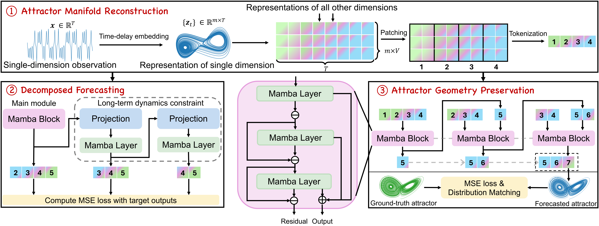
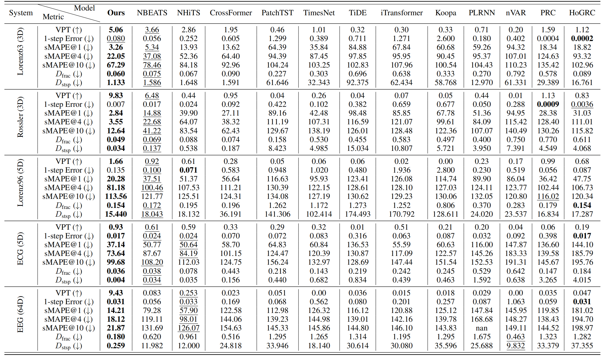

# PhyxMamba

Long-term forecasting of chaotic systems from short-term observations remains a fundamental and underexplored challenge due to the intrinsic sensitivity to initial conditions and the complex geometry of strange attractors. Existing approaches often rely on long-term training data or focus on short-term sequence correlations, struggling to maintain predictive stability and dynamical coherence over extended horizons. We propose PhyxMamba, a novel framework that integrates a Mamba-based state-space model with physics-informed principles to capture the underlying dynamics of chaotic systems. By reconstructing the attractor manifold from brief observations using time-delay embeddings, PhyxMamba extracts global dynamical features essential for accurate forecasting. Our generative training scheme enables Mamba to replicate the physical process, augmented by multi-token prediction and attractor geometry regularization for physical constraints, enhancing prediction accuracy and preserving key statistical invariants. Extensive evaluations on diverse simulated and real-world chaotic systems demonstrate that PhyxMamba delivers superior long-term forecasting and faithfully captures essential dynamical invariants from short-term data. This framework opens new avenues for reliably predicting chaotic systems under observation-scarce conditions, with broad implications across climate science, neuroscience, epidemiology, and beyond.

# Installation
## Environment
- Tested OS: Linux
- Python 3.11.0
- PyTorch 2.2.1+cu121
## Training
Place download the dataset folders from [Dropbox](https://www.dropbox.com/scl/fo/ne729sej6wi17jtyhyja4/APcOfNXqJ2UolDZ1_dagxCQ?rlkey=1djf32wiykl0jzqyzex4ln9ru&st=tsjmmtrq&dl=0), and put the dataset into the corresponding ```data``` folder. Then run the following instruction:
```
# Lorenz63 system
python run.py --lookback 30 --token_size 10 --test_warmup_steps 30 --horizon_tr 1 --horizon_multistep 30 --system Lorenz --shift_dataset 1 --large_train 1 --large_train_ratio 1.0 --val_long 0 --model Mamba_MTP --d_model 256 --mamba_d_state 1024 --mamba_expand 2 --mamba_headdim 64 --data_emb_conv_kernel 0 --CD 1 --use_revin 0 --use_norm 0 --max_epoch 1600 --stage1_max_epoch 800 --stage2_linear_epoch 50 --batch_size 512 --lr 1e-3 --finetune_lr 1e-4 --val_interval 5 --data_ratio 1.0 --allow_gpu_list '[3]' --memory_size 2000 --save_pred --multi_init_test --patch_model_method flatten_linear --embedding_method psr --delay_emb_dim 3 --delay_tau 7 --hier_layers 4 --mtp_steps 3 --lambda_mtp_loss 1e-1 --lambda_uncond_mmd 1 --lambda_cond_mmd 1000
```

```
# Rossler system
python run.py --test_only --lookback 30 --token_size 5 --test_warmup_steps 30 --horizon_tr 1 --horizon_multistep 30 --system Rossler --shift_dataset 1 --large_train 1 --large_train_ratio 1.0 --val_long 0 --model Mamba_MTP --d_model 256 --mamba_d_state 1024 --mamba_expand 2 --mamba_headdim 64 --data_emb_conv_kernel 0 --CD 1 --use_revin 0 --use_norm 0 --max_epoch 1600 --stage1_max_epoch 800 --stage2_linear_epoch 50 --batch_size 512 --lr 1e-3 --finetune_lr 1e-4 --val_interval 5 --data_ratio 1.0 --allow_gpu_list '[3]' --memory_size 2000 --save_pred --multi_init_test --patch_model_method flatten_linear --embedding_method psr --delay_emb_dim 3 --delay_tau 7 --hier_layers 1 --mtp_steps 3 --lambda_mtp_loss 1e-1 --lambda_uncond_mmd 1 --lambda_cond_mmd 1000
```

```
# Lorenz96 system
python run.py --test_only --lookback 30 --token_size 5 --test_warmup_steps 30 --horizon_tr 1 --horizon_multistep 30 --system Lorenz96 --shift_dataset 1 --large_train 1 --large_train_ratio 1.0 --val_long 0 --model Mamba_MTP --d_model 256 --mamba_d_state 1024 --mamba_expand 2 --mamba_headdim 64 --data_emb_conv_kernel 0 --CD 1 --use_revin 0 --use_norm 0 --max_epoch 1600 --stage1_max_epoch 800 --stage2_linear_epoch 50 --batch_size 512 --lr 1e-3 --finetune_lr 1e-4 --val_interval 5 --data_ratio 1.0 --allow_gpu_list '[3]' --memory_size 2000 --save_pred --multi_init_test --patch_model_method flatten_linear --embedding_method psr --delay_emb_dim 4 --delay_tau 3 --hier_layers 3 --mtp_steps 3 --lambda_mtp_loss 1e-1 --lambda_uncond_mmd 1 --lambda_cond_mmd 1000
```

```
# ECG system
python run.py --lookback 30 --token_size 2 --test_warmup_steps 30 --horizon_tr 1 --horizon_multistep 30 --system ECG --shift_dataset 1 --large_train 1 --large_train_ratio 1.0 --val_long 0 --model Mamba_MTP --d_model 256 --mamba_d_state 1024 --mamba_expand 2 --mamba_headdim 64 --data_emb_conv_kernel 0 --CD 1 --use_revin 0 --use_norm 0 --max_epoch 1600 --stage1_max_epoch 800 --stage2_linear_epoch 50 --batch_size 512 --lr 1e-3 --finetune_lr 1e-4 --val_interval 5 --data_ratio 1.0 --allow_gpu_list '[7]' --memory_size 2000 --save_pred --multi_init_test --patch_model_method flatten_linear --embedding_method psr --delay_emb_dim 4 --delay_tau 6 --hier_layers 4 --mtp_steps 3 --lambda_mtp_loss 1e-1 --lambda_uncond_mmd 1 --lambda_cond_mmd 1000
```

```
# EEG system
python run.py --lookback 60 --token_size 12 --test_warmup_steps 60 --horizon_tr 1 --horizon_multistep 60 --system EEG --shift_dataset 1 --large_train 1 --large_train_ratio 1.0 --val_long 0 --model Mamba_MTP --d_model 256 --mamba_d_state 1024 --mamba_expand 2 --mamba_headdim 64 --data_emb_conv_kernel 0 --CD 1 --use_revin 0 --use_norm 0 --max_epoch 1600 --stage1_max_epoch 800 --stage2_linear_epoch 50 --batch_size 512 --lr 1e-3 --finetune_lr 1e-4 --val_interval 5 --data_ratio 1.0 --allow_gpu_list '[0]' --memory_size 2000 --save_pred --multi_init_test --patch_model_method flatten_linear --embedding_method psr --delay_emb_dim 4 --delay_tau 9 --hier_layers 4 --mtp_steps 3 --lambda_mtp_loss 1e-1 --lambda_uncond_mmd 1 --lambda_cond_mmd 1000 --long_test_length 600 --test_single_step_only
```

After training, we can test the model by adding ```--test_only```, taking Lorenz63 system as the example:
```
python run.py --test_only --lookback 30 --token_size 10 --test_warmup_steps 30 --horizon_tr 1 --horizon_multistep 30 --system Lorenz --shift_dataset 1 --large_train 1 --large_train_ratio 1.0 --val_long 0 --model Mamba_MTP --d_model 256 --mamba_d_state 1024 --mamba_expand 2 --mamba_headdim 64 --data_emb_conv_kernel 0 --CD 1 --use_revin 0 --use_norm 0 --max_epoch 1600 --stage1_max_epoch 800 --stage2_linear_epoch 50 --batch_size 512 --lr 1e-3 --finetune_lr 1e-4 --val_interval 5 --data_ratio 1.0 --allow_gpu_list '[3]' --memory_size 2000 --save_pred --multi_init_test --patch_model_method flatten_linear --embedding_method psr --delay_emb_dim 3 --delay_tau 7 --hier_layers 4 --mtp_steps 3 --lambda_mtp_loss 1e-1 --lambda_uncond_mmd 1 --lambda_cond_mmd 1000
```

# Performance
We use point-wise accuracy metrics (sMAPE and VPT) as well as long-term statistics similarity metrics ($D_{\text{frac}}$ and $D_{\text{stsp}}$) to evaluate the performance of models. The main conclusions are:

- Our model consistently achieves state-of-the-art point-wise forecasting accuracy across all evaluated datasets.
- Beyond point-wise prediction, our model excels at preserving the long-term statistical characteristics and geometric integrity of the strange attractors inherent in the dynamical systems.
- Strong short-term predictive accuracy does not necessarily guarantee robust long-term forecasting performance.




# License
The software in this repository is freely available under MIT license. Please see the license for further details.